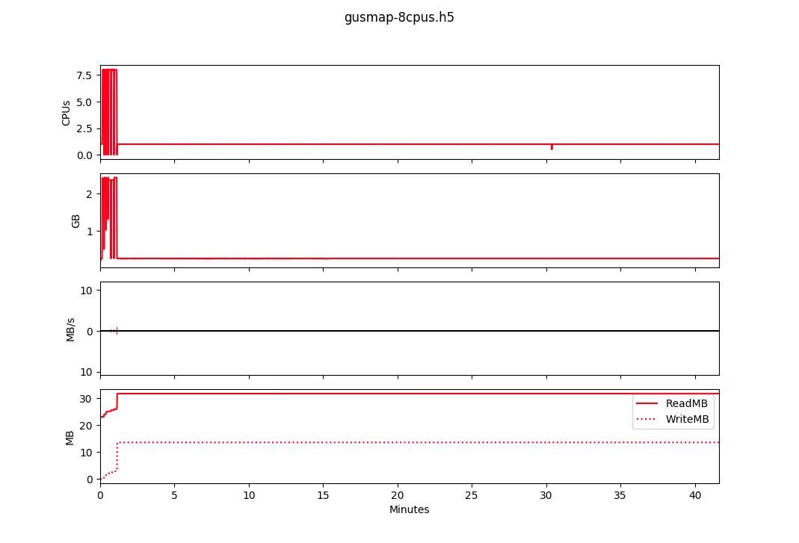

**Note**: doSNOW wasn't playing nice on the cluster under Slurm. We have a 
patched version of doParallel so I used that instead. It shouldn't make any
difference to performance.

# Example 1

## Run times for different numbers of threads

| Number of threads | Wall time (s) |
|-------------------|---------------|
| 1                 | 562.9         |
| 4                 | 288.2         |
| 8                 | 216.0         |

## Slurm profiling results


## Profiling with Rprof

```
options(keep.source=TRUE)
Rprof("profile.out", line.profiling = TRUE)

# code to profile goes here...

Rprof(NULL)

# output html file of profiling results
library(profvis)
p <- profvis(prof_input = "profile.out")
htmlwidgets::saveWidget(p, "profile.html")
```

## Hot Paths analysis

### 1 thread

```
 path                          total.pct self.pct
 MK_fs$rf_2pt                  75.31      0.00
 . rf_2pt_single (FS.R:73)     75.31      0.00
 . . %dopar% (rf_2pt.R:232)    15.70      0.00
 . . . e$fun                   15.70      0.00
 . . . . mclapply              15.65      0.00
 . . . . . lapply              15.65      0.00
 . . . . . . FUN               15.65      0.00
 . . . . . . . tryCatch        15.65      0.00
 . . . . . . . . tryCatchList  15.65      0.00
 . . . . . . . . . tryCatchOne 15.65     15.65
 . . %dopar% (rf_2pt.R:270)    15.26      0.00
 . . . e$fun                   15.26      0.00
 . . . . mclapply              15.20      0.00
 . . . . . lapply              15.20      0.00
 . . . . . . FUN               15.19      0.00
 . . . . . . . tryCatch        15.19      0.00
 . . . . . . . . tryCatchList  15.19      0.00
 . . . . . . . . . tryCatchOne 15.19     15.19
 . . %dopar% (rf_2pt.R:195)    13.69      0.00
 . . . e$fun                   13.69      0.00
 . . . . mclapply              13.65      0.00
 . . . . . lapply              13.65      0.00
 . . . . . . FUN               13.65      0.00
 . . . . . . . tryCatch        13.65      0.00
 . . . . . . . . tryCatchList  13.65      0.00
 . . . . . . . . . tryCatchOne 13.65     13.65
 . . %dopar% (rf_2pt.R:86)     12.02      0.00
 . . . e$fun                   12.02      0.00
 . . . . mclapply              11.96      0.00
 . . . . . lapply              11.96      0.00
 . . . . . . FUN               11.96      0.00
 . . . . . . . tryCatch        11.96      0.00
 . . . . . . . . tryCatchList  11.96      0.00
 . . . . . . . . . tryCatchOne 11.96     11.96
 . . %dopar% (rf_2pt.R:46)     10.31      0.00
 . . . e$fun                   10.31      0.00
 . . . . mclapply              10.25      0.00
 . . . . . lapply              10.25      0.00
 . . . . . . FUN               10.25      0.00
 . . . . . . . tryCatch        10.25      0.00
 . . . . . . . . tryCatchList  10.25      0.00
 . . . . . . . . . tryCatchOne 10.25     10.25
 MK_fs$rf_est                  23.83      0.00
 . rf_est_FS (FS.R:172)        19.77      0.00
 . . ?? (rfEst.R:372)          16.70     16.70
```

### 8 threads (not sure how accurate rprof is with threads!)

```
 path                            total.pct self.pct
 MK_fs$rf_est                    94.56      0.00
 . rf_est_FS (FS.R:172)          78.48      0.00
 . . ?? (rfEst.R:372)            66.32     66.32
 . . optim (rfEst.R:242)         12.03      0.00
 . . . .External2                12.03      0.00
 . . . . <Anonymous>             12.03      0.00
 . . . . . gr                    10.92      0.00
 . . . . . . ?? (wrappers.R:106) 10.45     10.45
 . infer_OPGP_FS (FS.R:167)      16.04      0.00
 . . rf_est_FS_UP (OPGP.R:112)   15.99      0.00
 . . . ?? (rfEst.R:513)           7.97      7.97
 . . . .Call (rfEst.R:513)        7.94      7.94
 VCFtoRA                          1.92      0.00
 MK_fs$rf_2pt                     1.87      0.00
 . rf_2pt_single (FS.R:73)        1.87      0.00
```

# Example 2

## Run times for different numbers of threads

| Number of threads | Wall time (s) |
|-------------------|---------------|
| 8                 | 2499.3        |

## Slurm profiling results



## Hot Paths analysis

```
 path                             total.pct self.pct
 simData$rf_est                   87.52      0.00
 . infer_OPGP_FS (FS.R:167)       74.38      0.00
 . . rf_est_FS_UP (OPGP.R:112)    74.38      0.00
 . . . optim (rfEst.R:443)        74.37      0.00
 . . . . .External2               74.37      0.03
 . . . . . <Anonymous>            74.35      0.05
 . . . . . . fn                   74.30      0.00
 . . . . . . . ?? (wrappers.R:84) 32.41     32.41
 . . . . . . . ?? (wrappers.R:82) 21.10     21.10
 . . . . . . . ?? (wrappers.R:83) 20.38     20.38
 . rf_est_FS (FS.R:172)           13.14      0.00
 . . optim (rfEst.R:242)          13.13      0.00
 . . . .External2                 13.13      0.01
 . . . . <Anonymous>              13.12      0.00
 . . . . . gr                     12.72      0.00
 . . . . . . ?? (wrappers.R:106)  12.53     12.53
 simData$rf_2pt                   12.17      0.00
 . rf_2pt_single (FS.R:73)        12.17      0.00
 . . %dopar% (rf_2pt.R:270)        2.52      0.00
 . . . e$fun                       2.52      0.00
 . . . . mclapply                  2.51      0.00
 . . . . . lapply                  2.51      0.00
 . . . . . . FUN                   2.51      0.00
 . . . . . . . tryCatch            2.51      0.00
 . . . . . . . . tryCatchList      2.51      0.00
 . . . . . . . . . tryCatchOne     2.51      2.51
 . . %dopar% (rf_2pt.R:232)        2.50      0.00
 . . . e$fun                       2.50      0.00
 . . . . mclapply                  2.49      0.00
 . . . . . lapply                  2.49      0.00
 . . . . . . FUN                   2.49      0.00
 . . . . . . . tryCatch            2.49      0.00
 . . . . . . . . tryCatchList      2.49      0.00
 . . . . . . . . . tryCatchOne     2.49      2.49
 . . %dopar% (rf_2pt.R:195)        2.34      0.00
 . . . e$fun                       2.34      0.00
 . . . . mclapply                  2.33      0.00
 . . . . . lapply                  2.33      0.00
 . . . . . . FUN                   2.33      0.00
 . . . . . . . tryCatch            2.33      0.00
 . . . . . . . . tryCatchList      2.33      0.00
 . . . . . . . . . tryCatchOne     2.33      2.33
```

# What next?

* Check Rprof profiling results when running on >1 thread
* Look at functions under `rf_est` and `rf_2pt`
  - Different options for parallelisation?
  - Any other optimisations (in the C code)
* Also, try to profile the C functions, to see where the time is spent there.

