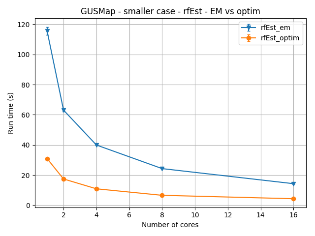
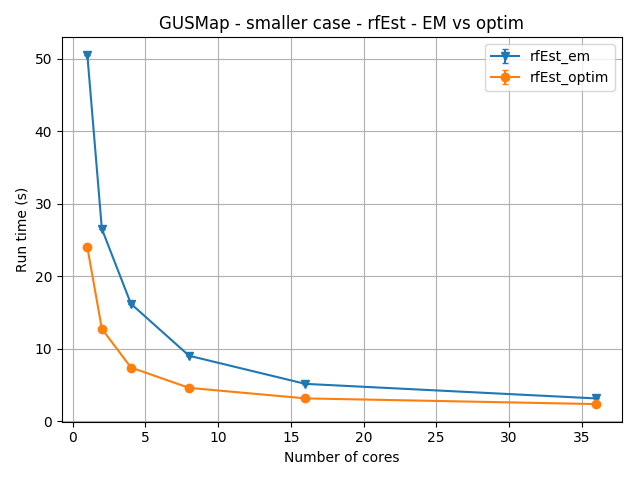
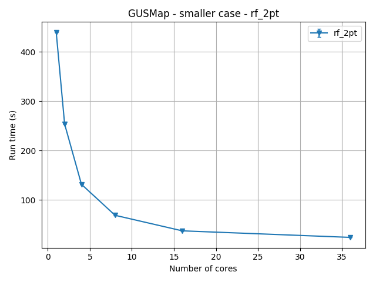

# Optimise call to rfEst for smaller case

Run code and `save` object to file just before the call, so we can just focus
on improving that section of code.

## Adding OpenMP

Loops in the following C functions were parallelised with OpenMP:

* `EM_HMM`
* `EM_HMM_UP`
* `ll_fs_scaled_err_c`
* `score_fs_scaled_err_c`

After making these changes the code was benchmarked (note: timings are just
for the call to `MK_fs$rf_est`):

### Benchmarks on Pan



| Num CPUs |  rfEst_em time (s) |  rfEst_optim time (s) |
|----------|------------------------|---------------------------|
| 1        |  115.6 ± 2.7 |  30.9 ± 0.6     |
| 2        |  63.1 ± 1.0  |  17.4 ± 0.3     |
| 4        |  39.9 ± 0.1  |  10.9 ± 0.0     |
| 8        |  24.3 ± 0.1  |  6.6 ± 0.0      |
| 16       |  14.3 ± 0.0  |  4.3 ± 0.0      |

### Benchmarks on Mahuika



| Num CPUs |  rfEst_em time (s) |  rfEst_optim time (s) |
|----------|----------------------------|-------------------------------|
| 1        |  50.6 ± 0.0      |  24.0 ± 0.0         |
| 2        |  26.5 ± 0.0      |  12.7 ± 0.1         |
| 4        |  16.2 ± 0.0      |  7.4 ± 0.0          |
| 8        |  9.0 ± 0.0       |  4.6 ± 0.0          |
| 16       |  5.2 ± 0.0       |  3.2 ± 0.0          |
| 36       |  3.2 ± 0.0       |  2.4 ± 0.0          |

* More cores available on Mahuika
* "EM" version is significantly faster on Mahuika
* At high core counts, EM and optim perform about the same

## OpenMP notes

OpenMP is an API for shared memory parallelisation (i.e. within a node)

### Compiling R package with OpenMP

Adding the file `src/Makevars` with the following content should enable
OpenMP at compile time:

```
PKG_LIBS = $(SHLIB_OPENMP_CFLAGS)
PKG_CFLAGS = $(SHLIB_OPENMP_CFLAGS)
```

### Setting the number of threads to use

* using an environment variable: `export OMP_NUM_THREADS=8`
* in Slurm with an environment variable:
  ```sh
  #!/bin/bash
  #SBATCH --cpus-per-task=8
  # other SBATCH directives

  export OMP_NUM_THREADS=$SLURM_CPUS_PER_TASK
  srun <my_program>
  ```
* in the `pragma` statement using the `num_threads` clause (this applies
  only to this loop):
  ```c
  int nthreads = 8;
  #pragma omp parallel for num_threads(nthreads)
  for (...) {...}
  ```
* using a library call (this applies to all subsequent OpenMP loops):
  ```c
  // must include OpenMP header if call omp_* functions
  #include <omp.h>
  
  int nthreads = 8;
  omp_set_num_threads(nthreads);
  ```

### Simple parallel loop

For a very simple loop:

```c
for (int i = 0; i < size; i++) {
    my_array[i] = i * i;
}
```

it can be as easy as adding one line:

```c
#pragma omp parallel for
for (int i = 0; i < size; i++) {
    my_array[i] = i;
}
```

The `#pragma omp parallel for` tells the compiler that the following loop
should be run in parallel. Note, if the compiler does not support OpenMP it
ignores this line and the loop will run in serial (there won't be an error).

Some loops cannot be parallelised, for example if each iteration uses a value
computed at a previous iteration, e.g.:

```c
my_array[0] = 0;
for (int i = 1; i < size; i++) {
    my_array[i] = my_array[i - 1] + i;
}
```

If you try to parallelise this loop then you will probably get a completely
wrong result (it may not fail though).

### Private vs shared variables

Variables that are used inside a parallel loop are either `shared` or `private`
and the default is for them to be `shared` (the loop variable, `i` in this
example, is always private). Consider the following loop:

```c
int my_array[size];
int my_value;
for (int i = 0; i < size; i++) {
    my_value = i * i;
    my_array[i] = my_value;
}
```

If we added the OpenMP `pragma` then, by default, both `my_array` and `my_value`
would be shared between parallel
threads. This is fine for `my_array`; we want it to be shared so that
multiple threads can populate its values at the same time (note, however,
that at each iteration a different element will be populated, no two threads
will ever try to populate the same element of the array).

However, `my_value` is also shared. This is bad, because multiple threads
will be writing to that value at the same time and the result will probably be
wrong. There are (at least) two ways around this. First, one could declare the
variable as `private`, meaning that each thread will have its own copy of
that variable:

```c
int my_array[size];
int my_value;
#pragma omp parallel for private(my_value)
for (int i = 0; i < size; i++) {
    my_value = i * i;
    my_array[i] = my_value;
}
```

Secondly, one could define the variables that are private to a loop only
within the scope of that loop, making them implicitly private.

```c
int my_array[size];
#pragma omp parallel for
for (int i = 0; i < size; i++) {
    int my_value;
    my_value = i * i;
    my_array[i] = my_value;
}
```

If you want to be really safe, or you have lots of variables and it is
difficult to work out which should be private, you can make it so that all
variables must be explicitly declared as private or shared (excluding those
variables that are defined only within the scope of the loop), using
`default(none)`:

```c
int my_array[size];
int my_value;
#pragma omp parallel for default(none) private(my_value) shared(my_array)
for (int i = 0; i < size; i++) {
    my_value = i * i;
    my_array[i] = my_value;
}
```

### Reductions

OpenMP supports doing parallel reductions; a common operation is computing a
sum within a loop. This is achieved with the `reduction` clause, which
supports a number of operators.

```c
int my_sum = 0;
#pragma omp parallel for reduction(+:my_sum)
for (int i = 0; i < size; i++) {
    my_sum += my_array[i];
}
```

Here, each thread will have its own copy of `my_sum`, initialised to zero. At
the end of the loop the values from each thread will be reduced to one value
using the operator specified in the `reduction` clause (`+` here).

Note, without the `reduction` clause, multiple threads could
write to `my_sum` at the same time and cause the result to be wrong.

Also note, that parallel reductions can break bit compatibility of results, as
the order in which local copies of `my_sum` are added up can different each
time the program is run, leading to different results due to roundoff errors.

### Atomic operations

When an operation is marked as `atomic` it is guaranteed that only one thread
will perform that operation at a given time. Therefore it is best to try to
avoid `atomic` operations if possible, since they can result in a thread
spending time waiting for other threads to complete an operation before that
thread can proceed. However, sometimes `atomic` operations are required.

```c
#pragma omp parallel for
for (int i = 0; i < size1; i++) {
    for (int j = 0; j < size2; j++) {
        int value = my_array[i] * j;
        #pragma omp atomic
        score[j] += value;
    }
}
```

Here, multiple threads, which are running the `i` loop in parallel, could
try to access the same element of the `score` array at the same time. The
`atomic` clause ensures this does not happen.

# Scaling for rf_2pt smaller case

Also ran benchmarks on Mahuika for the `rf_2pt` call (smaller case).



* No changes from us here
  - Using R parallel for loops that were already there
  - Disable OpenMP parallelisation when calling from the R parallel for loop
* ~440s (1 core) down to ~25s (36 cores) - around 18x faster!
